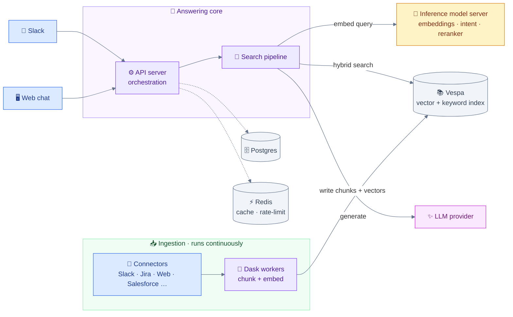
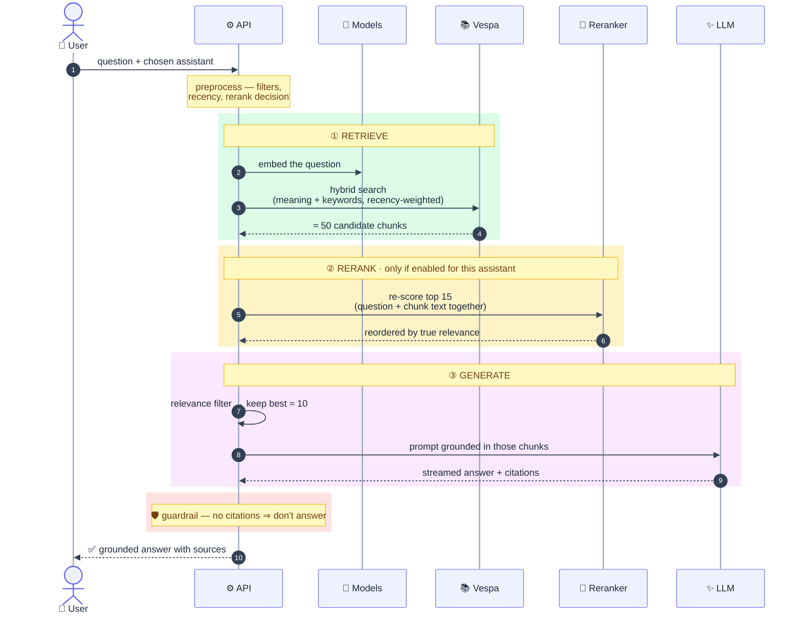
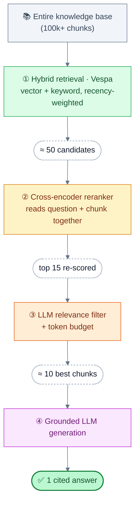
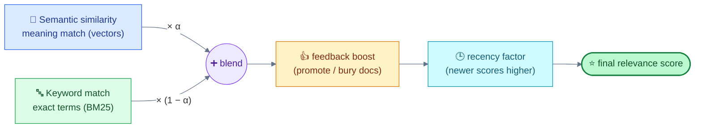
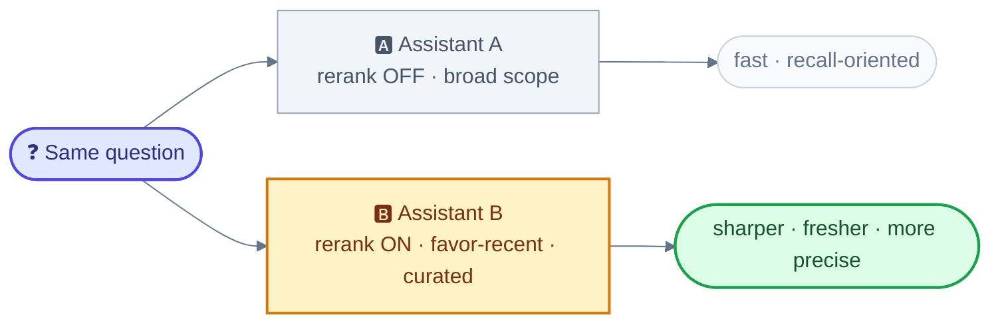
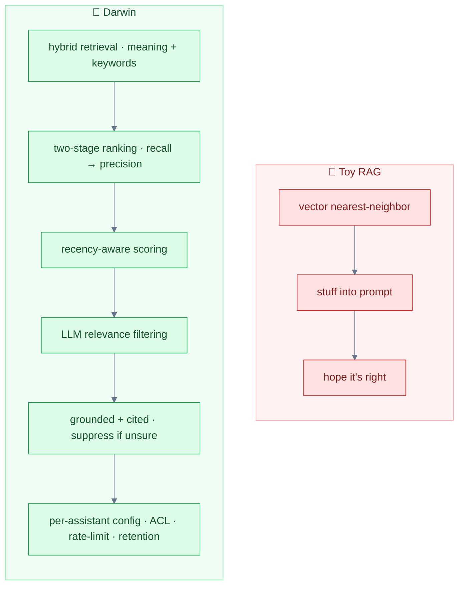

# How Darwin Answers a Question

A visual tour of how Darwin turns a question (in **Slack** or the **web chat**)
into a **grounded, cited answer** — and the knobs that change that behavior.
Written for a mixed audience: enough pictures for a stakeholder conversation,
enough specifics that engineers trust it.

> **TL;DR** — Darwin is **not** a "stuff some chunks into a prompt" toy RAG.
> Every question runs through hybrid retrieval → recency-aware ranking → an
> optional neural reranker → an LLM relevance filter → answer-grounding
> guardrails — all configurable **per assistant**. That depth is where answer
> quality and trust come from.
>
> Engineering deep-dive (file:line, exact ranking math, rollout plan):
> [`search-quality-reranking-and-recency.md`](./search-quality-reranking-and-recency.md).

---

## 1. The moving parts



Two independent halves:
- **📥 Ingestion (always on):** connectors pull documents → Dask workers chunk &
  embed them → everything lands in **Vespa**. (Smart enough to *skip*
  re-indexing unchanged content.)
- **🧩 Answering (per question):** the path in §2.

---

## 2. The journey of a question

The same pipeline serves **both** Slack and web chat — they differ only in entry
point and presentation, not in how retrieval/ranking work.



---

## 3. The retrieval funnel — where quality comes from

A question doesn't get "the top chunks." It gets **progressively narrowed** by
increasingly precise (and expensive) stages — broad recall first, sharp
precision last:

```
        hundreds of thousands of indexed chunks
   ████████████████████████████████████████████████   KNOWLEDGE BASE
                          │  ① hybrid retrieval  (meaning + keywords + recency)
              ██████████████████████████              ≈ 50 candidates
                          │  ② cross-encoder rerank   (question + chunk together)
                    ██████████████                    top 15, re-scored
                          │  ③ LLM relevance filter + token budget
                       ████████                       ≈ 10 best chunks
                          │  ④ grounded generation + citation check
                          ▼
                        ✅ 1 trustworthy answer
```



Why each stage matters:

| Stage | What it does | Why it's not trivial |
|---|---|---|
| **① Hybrid retrieval** | Finds candidates by **meaning** (vector) *and* **exact terms** (keyword/BM25), fused, then weighted by recency | Pure vector misses exact IDs/error codes; pure keyword misses paraphrases. Fusion catches both. |
| **② Reranking** | A neural **cross-encoder** reads the question and each chunk *together* and re-scores | Retrieval embeds the chunk *before* it sees your question; the reranker judges actual relevance and fixes "right doc, ranked too low." |
| **③ Relevance filter** | An LLM pass drops off-topic chunks before answering | Stops near-misses from diluting the prompt → fewer confident-but-wrong answers. |
| **④ Grounded generation** | Answer built only from selected chunks, with citations | If it can't cite, Darwin **stays silent** rather than hallucinate. |

---

## 4. Hybrid search, in one picture

Every candidate's score blends two signals, then is nudged by freshness and human
feedback:



> `score = ( α · semantic + (1 − α) · keyword ) × feedback_boost × recency`
> — **α** is the dial between meaning and exact terms (default leans semantic).

This is the *search engine* under the chatbot — a real ranking system, not a
nearest-neighbor lookup.

---

## 5. Recency — preferring fresh knowledge

Two equally-relevant docs shouldn't tie when one is from last week and one is
three years old. Darwin multiplies each score by a **recency factor** that decays
with document age:

> `recency_factor = max( 1 / (1 + decay × age_in_years),  0.75 )`

```
score multiplier by document age   (1.00 = full score)

           new     6 mo    1 yr    2 yr+
default   ██████  █████▍  █████   ████▌    1.00 → 0.89 → 0.80 → 0.75 (floor)
favor-    ██████  █████   ████▌   ████▌    1.00 → 0.80 → 0.75 → 0.75
recent
```

- A **soft nudge**, not a cliff — a clearly-better old doc can still win.
- The **0.75 floor** caps the penalty at 25% (tunable). Decay strength is set
  **per assistant** (`favor_recent` is more aggressive) or globally.
- The lever for "prefer recent" without discarding authoritative older content.

---

## 6. The knobs — same engine, different behavior

Darwin's behavior is **configured, not hardcoded** — globally and **per
assistant** (each assistant has its own knowledge scope, prompt, and ranking
behavior).

| Knob | Where | Default | When on |
|---|---|---|---|
| **Neural reranking** | global switch **and** per-assistant toggle | raw hybrid order | top candidates reordered by a cross-encoder (sharper relevance) |
| **Recency preference** | per assistant | mild decay | stronger tilt toward recent docs |
| **LLM relevance filter** | per assistant | — | off-topic chunks dropped pre-answer |
| **Citations required** | per Slack channel | — | no citations ⇒ **no answer** (won't bluff) |
| **Source diversity** | automatic (global) | on | guarantees curated KB/web docs aren't crowded out of the prompt by a chatty source |
| **Guardrails** | built in | — | ACL filtering · rate limiting · retry/backoff |



This is what makes a **controlled rollout** possible: enable a capability on
*one* assistant, compare answers side-by-side, then make it the default — no
big-bang switch.

---

## 7. Why this isn't a toy RAG

A weekend RAG demo is: embed docs → nearest-neighbor → stuff prompt. Darwin adds
the parts that decide whether answers are **trustworthy at scale**:



- **Two-signal hybrid retrieval** (meaning *and* keywords), not just vectors.
- **Two-stage ranking** — cheap recall (bi-encoder) then expensive precision
  (cross-encoder) — the standard of serious search systems.
- **Recency-aware ranking** so stale content doesn't masquerade as current.
- **LLM relevance filtering** before generation.
- **Grounded, cited answers with hallucination suppression** — would rather say
  nothing than make something up.
- **Per-assistant configurability** — different teams, knowledge scopes, prompts,
  and ranking behavior from one platform.
- **Enterprise plumbing** — permissions/ACL, rate limiting, retention, a broad
  connector ecosystem, and a horizontally-scaled indexing pipeline.
- **Operational depth** — separate embedding/indexing/reranking model servers,
  Redis caching, CPU-optimized reranking (TEI), incremental & measurable rollouts.

Each layer is a deliberate quality or trust decision. That's the "meat": the gap
between a chatbot that *sounds* right and one you can put in front of the
business.

---

*Companion deep-dive:*
[`search-quality-reranking-and-recency.md`](./search-quality-reranking-and-recency.md)
*(architecture, exact ranking math, file references, rollout plan).*
